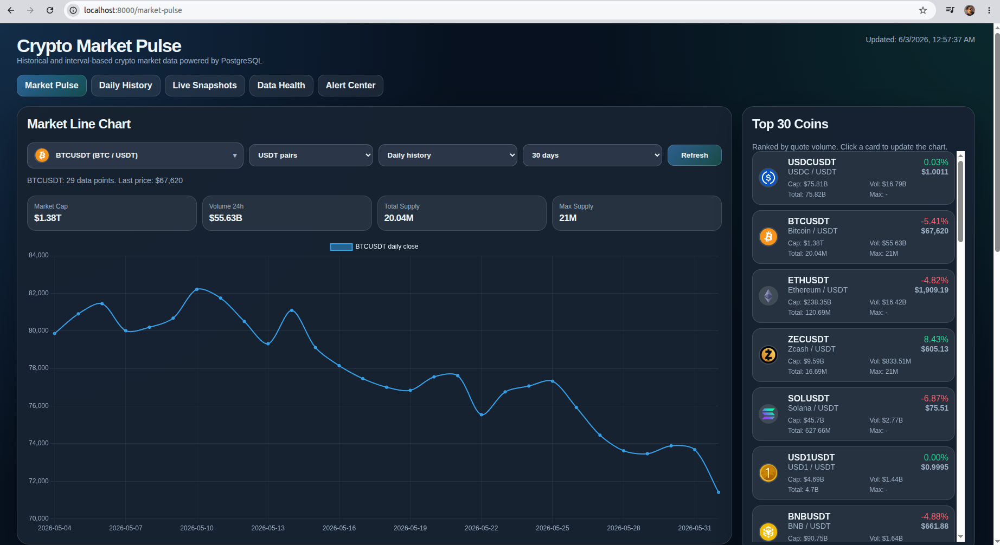
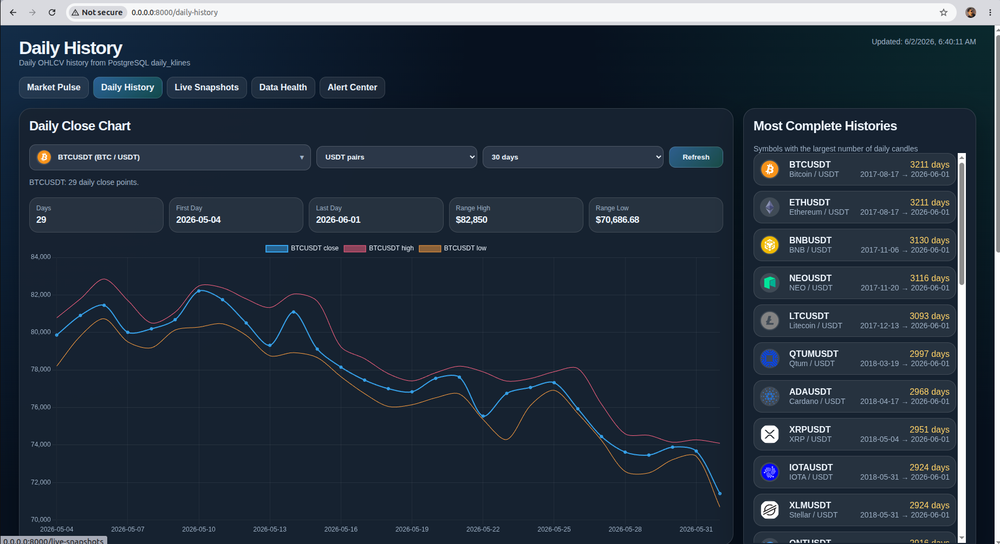
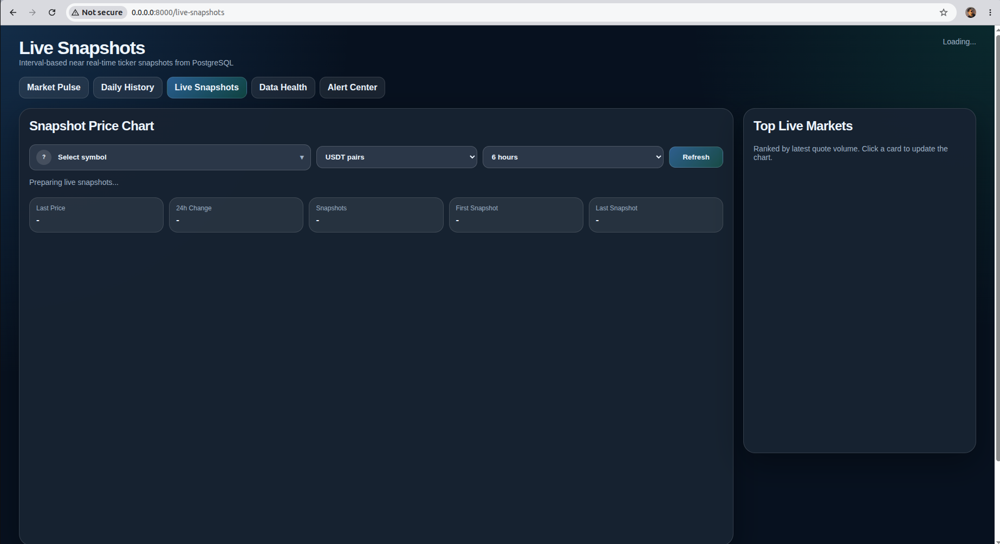
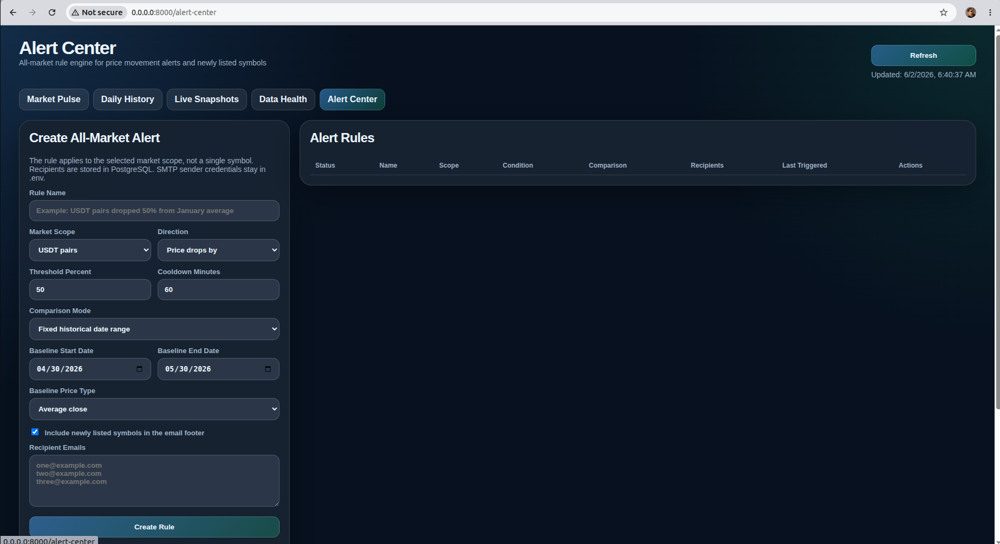

# Crypto Market Pulse

Dockerized data engineering project for cryptocurrency market ingestion, PostgreSQL storage, FastAPI dashboards, and email alerts.

Crypto Market Pulse collects historical and near real-time market data from Binance, enriches it with CoinGecko metadata, stores everything in PostgreSQL, and exposes a FastAPI web dashboard.

## Features

- Binance daily OHLCV historical sync
- Near real-time Binance ticker snapshots
- PostgreSQL storage
- CoinGecko market metadata enrichment
- FastAPI web dashboard
- Market Pulse dashboard
- Daily History dashboard
- Live Snapshots dashboard
- Data Health monitoring
- Alert Center with all-market alert rules
- SMTP email alert support
- Docker Compose one-command startup

## Screenshots

### Market Pulse



### Daily History



### Live Snapshots



### Alert Center



## Services

- postgres
- init_db
- realtime_ingestor
- daily_sync
- coingecko_sync
- alert_worker
- web_app

## Setup

Copy the example environment file:

```bash
cp .env.example .env
```

Edit `.env` if needed.

For Gmail alerts, use a Gmail App Password, not your normal Gmail password.

## Run

```bash
docker compose up -d --build
```

Open the dashboard:

```text
http://localhost:8000
```

## Stop

```bash
docker compose down
```

Do not use `docker compose down -v` unless you want to delete the PostgreSQL Docker volume.

## First Run Notes

On the first run, the PostgreSQL database starts empty.

The realtime ticker tables usually populate within 1-2 minutes:

- `market_ticker_latest`
- `market_ticker_history`

The historical daily OHLCV sync can take longer because it backfills daily Binance candles for many symbols:

- `daily_klines`

During the first historical backfill, some dashboards may show partial or empty data until the sync progresses.

Monitor progress:

```bash
docker logs -f crypto_daily_sync
docker logs -f crypto_realtime_ingestor
```

Check row counts:

```bash
PGPASSWORD=12345 psql -h localhost -p 5432 -U crypto_user -d crypto_market -c "SELECT COUNT(*) FROM daily_klines;"
PGPASSWORD=12345 psql -h localhost -p 5432 -U crypto_user -d crypto_market -c "SELECT COUNT(*) FROM market_ticker_history;"
```

## Useful Logs

```bash
docker logs -f crypto_web_app
docker logs -f crypto_realtime_ingestor
docker logs -f crypto_alert_worker
docker logs -f crypto_daily_sync
docker logs -f crypto_coingecko_sync
```

## Alert Center

Alert Center supports all-market alert rules.

Example:

```text
Scope: USDT pairs
Direction: Price drops by
Threshold: 50%
Comparison: Fixed historical date range
Baseline: Average close
Recipients: multiple emails
```

SMTP credentials are loaded from `.env` and are not committed to Git.

## Security

Never commit `.env`, Gmail App Passwords, database dumps, or personal credentials.

Use `.env.example` for public configuration examples.

## License

MIT License.
